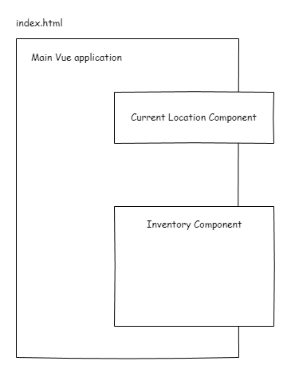

# Application Design

## Web Application

The `Inventory Companion` is a simple single page web application consisting only of one page, the inventory page.

The [Vue 3](https://vuejs.org/) application framework was used to develop the single page application. The main page would
 only have a list of all the items available in the game. This list can be found in the back of the book section A2.

Also a place to keep track of your current location in the book would be usefull. This would just be a numerical value.

These section would be componments on the main Vue application which is maounted on the _index.html_ page.



### Data Structure

A JSON structure was created to be able to save and load the data with ease.

```json
{
  "currentLocation": number,
  "inventory": [
    {
      "handle": string,
      "description": string,
      "checked": boolean
    }
  ]
}
```

## Mobile Application

The build tool Vite is configurted to build the web application into the `www` folder.

[Apache Cordova](https://cordova.apache.org/) is used to build the web applicaton into the Android mobile application.
